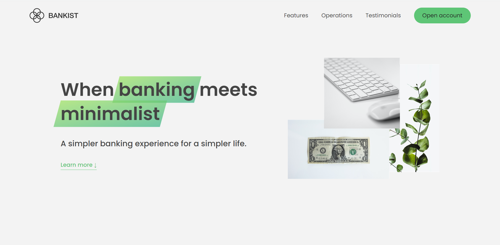
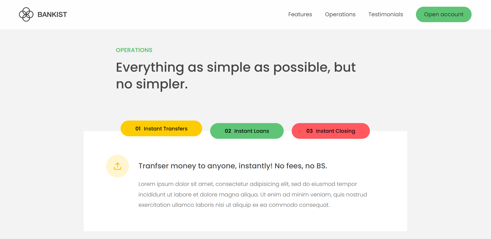
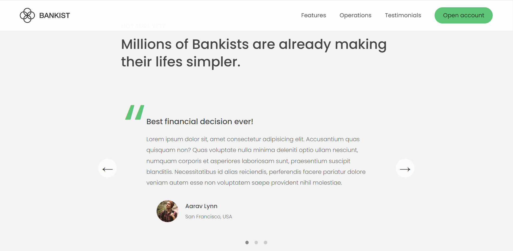

# 🌿💵 Bankist Website Project

Marketing/web page of a bank that prensents its features and explains the operations

# Built with

Project is built with HTML, CSS, JavaScript.

# Reach Bankist Website

You can reach the project here, [Bankistweb](https://bankistberenwebsite.netlify.app/)

# Visual of the project

# Acknowledgments

Project is built during the course in Udemy.
The Complete JavaScript Course 2023: From Zero to Expert! by Jonas Schmedtmann.
